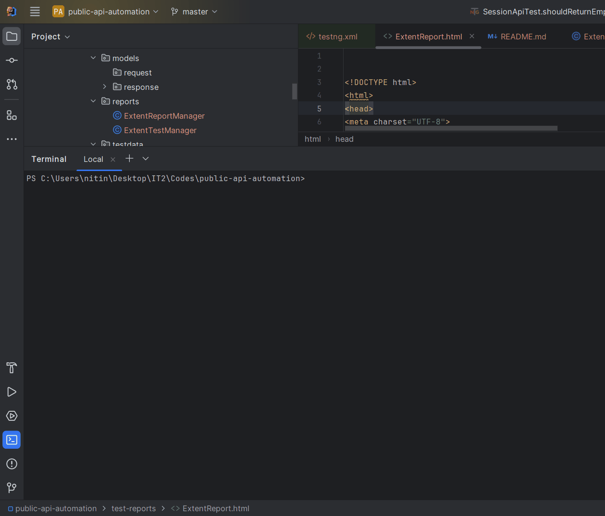

# OpenF1 API Automation Framework

A REST API automation framework built using **Java**, **RestAssured**, **TestNG**, and **Maven** to validate the OpenF1 APIs. The framework follows a layered architecture with reusable API clients, service classes, POJO-based response deserialization, centralized configuration, and HTML reporting using Extent Reports.

---

## Features

- Layered framework architecture
- Generic reusable API client
- Service layer abstraction
- POJO-based response deserialization using Jackson
- Centralized endpoint and test data management
- HTML reporting using Extent Reports
- TestNG Suite Execution
- Maven Surefire Integration

---

## Tech Stack

| Technology | Version |
|------------|----------|
| Java | 21 |
| Maven | Latest |
| RestAssured | 5.x |
| TestNG | 7.x |
| Jackson | 2.x |
| Lombok | Latest |
| Extent Reports | 5.x |
| Log4j2 | 2.x |

---

# Framework Architecture

```
src
├── main
│   └── java
│       └── com.nitin.openf1
│           ├── builder
│           ├── client
│           ├── config
│           ├── constants
│           ├── models
│           │      └── response
│           └── reports
│
└── test
    ├── java
    │   └── com.nitin.openf1
    │       ├── listeners
    │       └── tests
    │
    └── resources
        ├── testsuite
        │      └── testng.xml
        └── config.properties
```

---

# Framework Design

The framework follows a layered architecture to improve maintainability, readability and scalability.

### Config Layer

Reads application configuration such as the API base URL.

### Request Builder

Creates reusable RestAssured request specifications.

### API Client

Contains a generic reusable HTTP client responsible for executing API requests.

### Service Layer

Encapsulates endpoint-specific business logic and query parameters.

### Response Models

POJO classes used for response deserialization.

### Constants

Stores reusable endpoint paths and test data.

### Test Layer

Contains TestNG test classes organized by API resource.

### Reporting

Generates HTML execution reports using Extent Reports.

---

# APIs Covered

## Drivers API

```
GET /drivers
```

### Validations

- HTTP Status Code
- Content Type
- Driver Number
- Session Key
- Meeting Key
- Driver Name
- Team Name

---

## Sessions API

```
GET /sessions
```

### Validations

- HTTP Status Code
- Content Type
- Country Name
- Session Name
- Year
- Session Key
- Meeting Key
- Session Start Date
- Session End Date
- Cancelled Status

---

# Validation Strategy

The framework validates both the HTTP response and the business data returned by the API.

## Response-Level Validation

- HTTP Status Code
- Content Type
- Expected number of records

## Business Validation

The framework validates key response attributes instead of asserting every field returned by the API. This keeps the tests maintainable while ensuring that the API returns the correct resource and essential business information.

## Negative Validation

The framework also validates scenarios where no matching data exists.

- Non-existing driver number returns an empty response.
- Invalid country returns an empty response.

These checks ensure that the API handles valid requests with no matching records gracefully.

---

# Automated Test Cases

| Test Class | Test Case | Type |
|------------|-----------|------|
| DriverApiTest | Validate driver details using valid driver number and session key | Positive |
| DriverApiTest | Validate empty response for non-existing driver number | Negative |
| SessionApiTest | Validate session details using valid country, session name and year | Positive |
| SessionApiTest | Validate empty response for invalid country | Negative |

---

# Test Execution

Execute the complete test suite using

```bash
mvn clean test
```

The Maven Surefire Plugin automatically executes the configured TestNG suite.

---

## Local Execution

```markdown

```

---

# Extent Report

After execution, an HTML report is generated at

```
test-reports/ExtentReport.html
```

The report includes

- Execution Summary
- Passed Tests
- Failed Tests
- Execution Duration
- Stack Trace for Failures

---

# Configuration

The API base URL is configured in

```
src/test/resources/config.properties
```

Example

```properties
base.url=https://api.openf1.org/v1
```

---

# Design Decisions

- Layered architecture for better maintainability
- Generic reusable HTTP client
- Service layer abstraction
- POJO-based deserialization
- Reusable Request Specification
- Centralized configuration management
- TestNG Listener for report generation
- Extent Reports for execution reporting
- Maven Surefire for suite execution

---

# Future Enhancements

- CI/CD Integration (GitHub Actions / Jenkins)
- Parallel Test Execution
- Multi-environment Support
- Docker-based Execution
- Request & Response Logging
- API Schema Validation

---

# Author

**Nitin Choudhary**

Senior QA / SDET | Java | RestAssured | TestNG | API Automation
